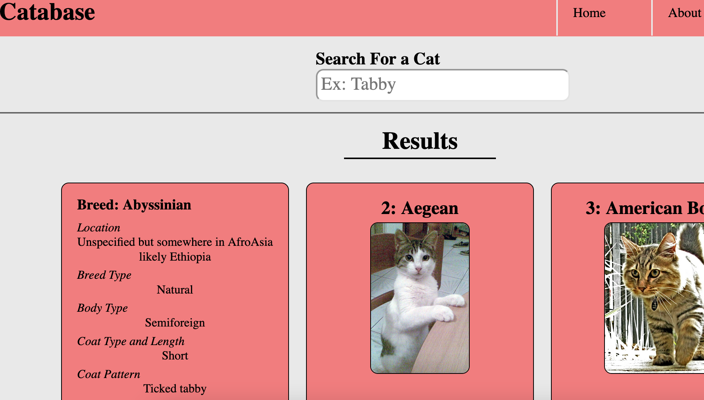

# Catabase
Parses a local database for information on cats and presents them in a card display format.

## How It's Made:

**Tech used:** HTML, CSS, JavaScript

Data is pulled from a custom Spring Boot database. Each image is populated into the screen with javaScript, and card animations are done with CSS.

## Lessons Learned:

I've spent most my time with Java and building backend business logic. With this project I wanted to learn more about what it takes to build a full stack application. I learned a lot about CORS, how to fetch data using javaScript and how to populate that data onto a page with javaScript. I learned a lot of new CSS tricks on how to create transitions and animations and organize CSS. 
